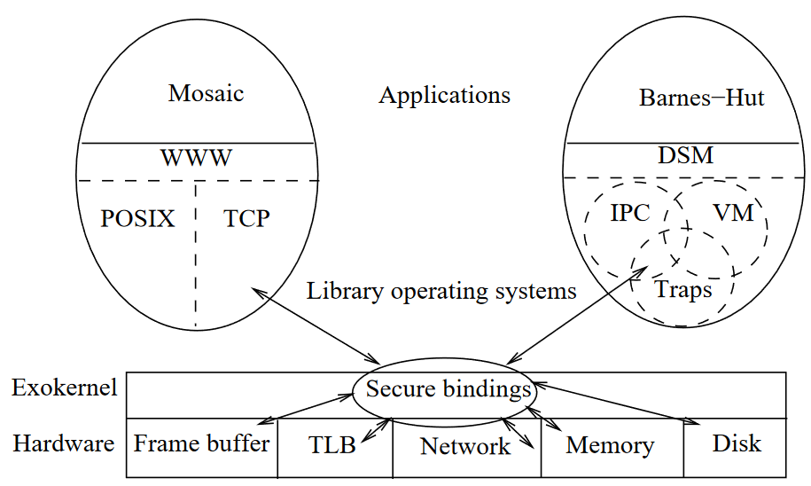
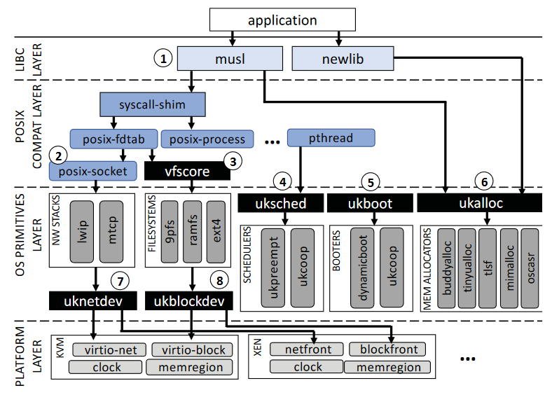
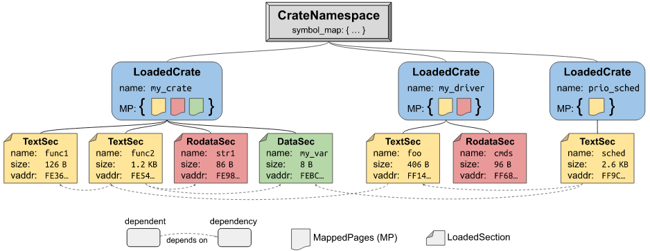
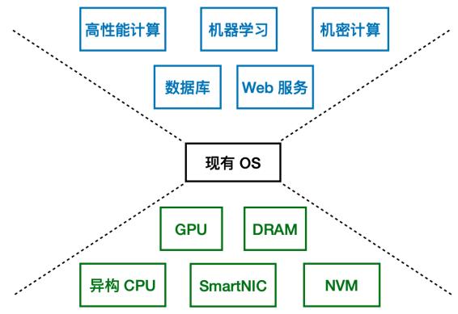
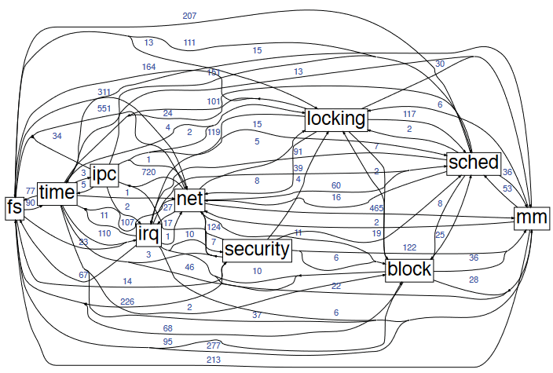
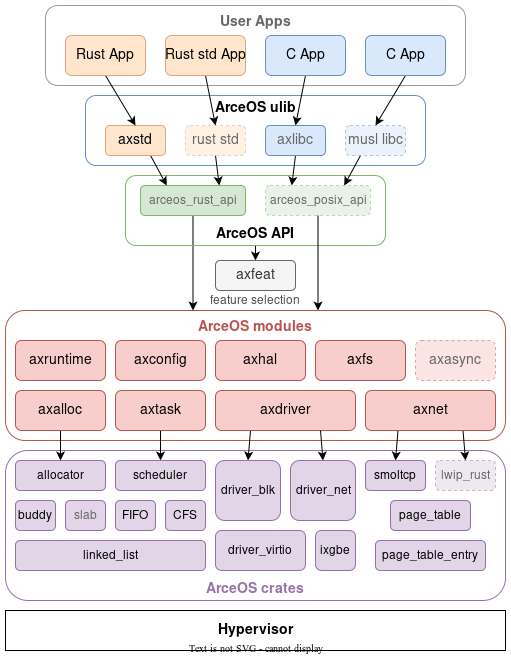
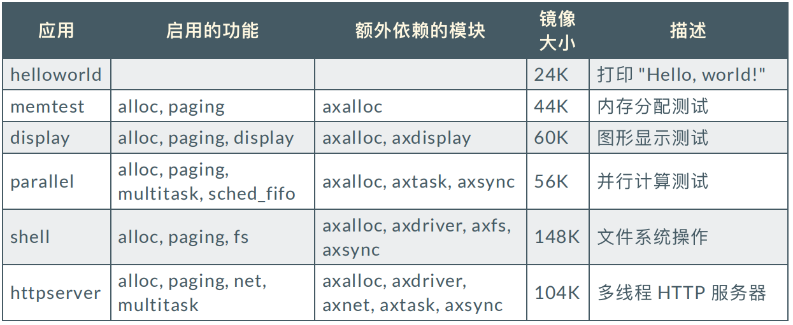

TODO: 切换成为 Awesome-Marp
<!-- _class: lead -->

# AcerOS

<br>

**著/报告者 刘逸珑**
软件过程 - 第8小组
2023/05/19

<!-- 
大家好，我是来自华南师范大学软件学院的刘逸珑，很荣幸今天能被邀请到这里简单分享我现在学习的 ArceOS 操作系统。
因为我现在还在学习的早期阶段，可能有很多知识还理解的不是很到位，还请诸位学长多多包涵，多多纠正我的错误。
-->

---

<!-- _header: 目录 -->

1. 发展历史
2. 开发背景
3. ArceOS 整体架构
4. ArceOS 特性

<!--
我今天的演讲主要分为以下几个部分
-->
---
<!-- _header: 起源::ExoKernel -->



<!--
1995年左右，ENGLER D R, KAASHOEK M F, O’TOOLE J 提出了一种相对于宏内核，微内核而言不同的新的内核形态，即外核(ExoKernel)。
外核架构与传统的操作系统架构不同，它将所有硬件资源安全地导出到不受信任的库操作系统（LibOS）。LibOS使用此接口来实现系统对象和策略。这种资源保护与管理的分离允许通过扩展、专门化甚至替换库来定制传统操作系统抽象的特定于应用程序的定制。
-->

---

<!-- _header: Rethinking the library OS from the top dow -->


<!--
类似于这个思路，PORTER 等将简单的单片操作系统 Win7 重构成为 Library OS，使用一个简单的抽象集连接了 Library OS 和 Host OS。
-->

---
<!-- _header: Unikernel -->

TODO: FINISH IT

---
<!-- _header: Unikraft -->




<!--
在 21 年的时候，来自德国和法国的多个研究机构，以 C 语言为主体，实现了一个真正意义上完整的完全模块化的微库操作系统，他将操作系统的所有原语完全模块化，并提供了一组可组合的、面向性能的 API。
TODO 考虑要不要加有关于链接的说明
-->

---
<!-- _header: Theseus -->

Theseus是一个用Rust从头开始编写的新操作系统，旨在尝试新的操作系统结构，更好的状态管理，以及如何利用语言内设计原则将操作系统的责任（如资源管理）转移到编译器中。

其中所有内容都在单一地址空间（SAS）和单一特权级别（SPL）中运行。 这包括从低级内核组件到高级操作系统服务、驱动程序、库等，一直到用户应用程序的所有内容。 保护和隔离是通过编译器和语言（Rust）确保的类型安全和内存安全来提供的。

<!--
大家应该可以直接从名字上练习到那个非常出名的哲学问题，
即当一条船的每一个部分都被更换成为新的之后，这条船还是原来那条船
Theseus 操作系统其实也很大程度上基于了这样的设想，这个操作系统实际上是多个 Cells 的组合（Cells ~ 可以加载到Theseus中的代码和/或数据的单个实体）
各个 Cells 就像是船板一样，有着可以被识别，明确规定的边界，不同的 Cells 之间可以被相互组合，可以在细胞衰退或者死亡之后独立进行替换。
-->

---
<!-- _header: Theseus -->



<!--
这些不同的组件聚集在Crate命名空间下面，在这个命名空间中实现了动态链接期间的快速链接关系解析。
下层是 LoadedCrate，这个实际上就对应着一个装载到内存中的 Crate (Rust Packages)。
在下层是对应着这个 Crates 的不同段的信息。
MappedPages（MP）对象是忒修斯对所拥有的内存区域的抽象

# Ref: https://www.theseus-os.com/Theseus/book/design/design.html#cell--crate
-->
---

<!-- _header: ArceOS::前言 -->

⽬前计算机软硬件的发展趋势：
- 硬件：新型硬件层出不穷
- 应⽤：对性能、安全的需求越来越⾼

操作系统：发展滞后
通⽤ OS：Linux，Windows
实时 OS：RT-Thread、FreeRTOS



<!--
现有的OS已经越来越难以满足现在的需求
-->

---

<!-- _header: ArceOS::前言 -->

- 目前已有的 OS 存在的问题
    - ⾯向通⽤场景，臃肿⽽笨重
    - 组件之间紧耦合，难以重⽤
    - 开发复杂，⻔槛⾼




<!--
- Linux 内核包含了许多用于网络、文件系统、设备驱动等方面的功能。这些功能对于大多数程序来说是无关的，但是它们会被链接进程序，导致程序的体积增加。此外，Linux 内核还包含了许多用于安全、性能调优等方面的功能。这些功能对于一些程序来说是必要的，但是它们对于其他程序来说是无关的，也会导致程序的体积增加。
- 使用 C 语言进行开发，存在很多安全漏洞
- 紧耦合，可重复性比较差
-->
---
<!-- _header: ArceOS::前言 -->

- 易于定制
    - 适应硬件与应⽤需求
    - ⾼安全、⾼性能、专⽤化
- 易于复⽤
    - Rust crate
    - Rust for Linux
- 易于开发
    - 层次化组件隐藏底层细节
    - 像开发应⽤⼀样开发 OS

<!--
小型的专用化OS才是今后的研发方向，
- 对于OS的功能可以深度的定制，可以引用针对于某个功能进行优化的模块
- 基于包管理器的生态，希望将操作系统中使用的模块重用到比如说rust for linux的内部，或者其他项目中
-->
---
<!-- _header: ArceOS::组件化 OS 的初步探索 -->

- 多架构：x86_64/aarch64/riscv64
- 多种调度算法：FIFO、Round-robin、CFS
- VirtIO net/blk/gpu 驱动
- 基于 smoltcp 的⽹络栈
- FAT32 ⽂件系统
- Rust / C 语⾔应⽤程序

---
<!-- _header: ArceOS::整体架构 -->
- 单应⽤
- 单地址空间（SAS）
- 单特权级（SPL）

#### 层次化
- crates
- modules
- ulib
- apps



<!--
ArceOS 最开始的时候基于开发能运行在车用操作系统 Hypervisor 上能运行的组件化的单一用途操作系统而被设计出来的，也因此默认底部是依赖 Hyper 的，但是目前按照 ArceOS 社区项目来看，未来是会逐渐支持在不同的硬件下面进行开发。
假设系统运行在 Hyper 下，这样系统就不需要自身完成隔离的任务
-->
---
<!-- _header: ArceOS::整体架构 -->
与 OS 的设计⽆关的公共组件
- linked_list
- page_table
- allocator
- scheduler
- drivers
- spinlock
...


<!--
其中 crates 层主要保存一些与操作系统无强关联的 crates，这些 crates 被设计发布在 crates.io 上供其他项目比如说 Rust-For-Linux 项目使用。
其实按照目前的设计来说，还不是完全没有与操作系统任何关联，部分地方是依赖操作系统提供接口实现的。
-->

---
<!-- _header: ArceOS::整体架构 -->
- 与 OS 的设计⽐较耦合的组件
    - axruntime
    - axtask
    - axnet
    - axsync
- 对 crates 组件的选取与封装:
    - axalloc
    - axdriver
    - axdisplay
...


<!--
不同于 crates 主要专注于可复用，modules 设计成为包含与 ArceOS 内部设计耦合的组件和一部分 crates 的封装
我们未来的开发目标是尽可能的减少modules的数量，增加crates的数量
-->

---


<!--
内核不再支持传统的 POSIX 接口使用传统的 linux 调用接口，大大缩短调用的路径，
同时，为了支持大量的现有的程序，我们计划支持musl和rust std
-->


---
<!-- _header: ArceOS::代码统计 -->




<!-- 
TODO: 是否要删除
这是一组我们之前测试的时候记录的数据
可以明显看出 ArceOS 的镜像大小是较少的
-->

---
<!-- _header: ArceOS::基于 features 的模块配置 -->

可以简单的通过对于应用程序 `Cargo.toml` 文件的修改实现对于启用不同模块的不同功能。

```toml
[dependencies] # apps/task/parallel/Cargo.toml
libax = {
    path = "../../ulib/libax",
    default-features = false,
    features = [
    "alloc", "paging", "multitask",
    "sched_fifo", # can be "sched_rr", "sched_cfs"
    ]
}
```

`rust` 语言所具有的条件编译特性可以避免编译非必要模块。

<!--
可以简单的通过对于应用程序 `Cargo.toml` 文件的修改实现对于启用不同模块的不同功能，就比如说这里我们通过最后一行中有关于 `sched_`的切换可以简单切换并发程序的算法。
同时，rust语言所具有的条件编译特性也可以很好的避免我们在编译的时候链接到非必要模块上。
-->

---
<style scoped>
{ font-size: 27px; }
</style>
<!-- _header: ArceOS::组件相互调用 -->

应用程序必要模块：
- axruntime：启动、初始化、组件总体管控
- axhal：硬件抽象层，提供跨平台的统⼀的 API
- axlog：打印⽇志
- axconfig：平台相关常量与内核参数定义


上层调⽤底层
- App -> ulib::axstd, ulib::axlibc
- ulib -> modules/crates
- modules -> modules/crates
- crates -> crates


<!--
那么一般应用程序的依赖是怎么进行的呢？
除了这上面的几个应用程序必要的依赖，剩下的 modules 和 crates 实际上都是可选的，用户可以自己决定程序所需要的模块以及features。

除了部分特殊的 crate 存在反向向上的依赖，其他大部分的情况下都是通过Cargo.toml文件来实现对应的依赖的。
-->
---
<!-- _header: ArceOS::组件相互调用::crate_interface -->

底层调用上层 || 循环依赖: Rust FFI 进⾏调⽤
axtask::kernel_guard(crate) 需要关闭内核抢占

```rust
// crates/kernel_guard/src/lib.rs
#[crate_interface::def_interface] // define
pub trait KernelGuardIf {
    fn disable_preempt();
    fn enable_preempt();
}
crate_interface::call_interface!(KernelGuardIf::disable_preempt); // call
```
```rust
// modules/axtask/src/lib.rs
struct KernelGuardIfImpl;
#[crate_interface::impl_interface]
impl kernel_guard::KernelGuardIf for KernelGuardIfImpl {
    fn disable_preempt() { do_disable_preempt(); } // implementation
    fn enable_preempt() { do_enable_preempt(); }
}
```
<!--
这里我们给出了一个简单的例子，就是我们 kernel_guard 的一部分实现。在这个是 crates 中关闭抢占是 ArceOS 实现自旋锁的基础，但是关闭内核抢占的这个操作是与操作系统紧密相关的，所以说必须实现在modules，按照一般的写法中，这个 kernel_guard 实际上也应该实现在 modules 中，但是我们将其拆解到了 crates 中进行实现（因为不符合拆分规则）。
像是在 C 语言中实现的话，我们只需要简单的调用头文件就可以对于对应的函数进行调用，但是我们认为这个是一个大问题，正是以为有这种混乱的调用关系导致了解耦困难。
但是直接在crates中调用modules中的功能实际上是反依赖链的，这里我们收到了global_allocator的启发，这时候我们就通过 rust FFI 来间接的实现调用。
-->

---
<!-- _header: ArceOS::组件相互调用::crate_interface -->

```rust
// crates/kernel_guard/src/lib.rs
extern "Rust" {
    fn __KernelGuardIf_disable_preempt();
    fn __KernelGuardIf_enable_preempt();
}
unsafe { __KernelGuardIf_disable_preempt() }; // call
```

```rust
// modules/axtask/src/lib.rs
impl kernel_guard::KernelGuardIf for KernelGuardIfImpl {
fn disable_preempt() {
    #[export_name = "__KernelGuardIf_disable_preempt"]
    fn __KernelGuardIf_disable_preempt() {  
        KernelGuardIfImpl::disable_preempt() 
    }
    do_disable_preempt(); // implementation
    } // fn enable_preempt() {}
}

```
<!--
你可以看到，这个是宏展开之后的效果，具体的实现被包装在axtask中，crates通过FFI间接的调用了modules实现的函数
-->
---
<!-- _header: ArceOS::组件注册 -->

基于 `axfs_vfs::VfsOps` 和 `axfs_vfs::VfsNodeOps` 在应用程序中实现⼀个⽂件系统：


```rust
struct NewFileSystem { /* ... */ }
struct NewFileNode { /* ... */ }
impl VfsOps for NewFileSystem {
    fn root_dir(&self) -> VfsNodeRef { /* ... */ }
    // ...
}
impl VfsNodeOps for NewFileNode {
    fn get_attr(&self) -> VfsResult<VfsNodeAttr> { /* ... */ }
    fn read_at(&self, offset: u64, buf: &mut [u8]) 
    -> VfsResult<usize> { /* ... */ }
    // ...
}
```
<!--
同时，利用这个现有的功能，我们可以比较好的实现在用户程序中注册并使用我们自己的组件，这样就可以尽可能的在核心库外复用各种有关于文件系统，驱动程序的实现。
我们通过实现 modules 中规定的 trait 可以比较好的在用户程序中注册并使用自定义组件。

-->
---
<!-- _header: ArceOS::组件注册 -->


```rust
struct MyFileSystemIfImpl;
#[crate_interface::impl_interface]
impl axfs::fops::MyFileSystemIf for MyFileSystemIfImpl {
    fn new_myfs(disk: Disk) -> Arc<dyn VfsOps> {
        Arc::new(NewFileSystem::new(disk))
    }
}
```

```toml
[dependencies]
axfs = { path = "../../../modules/axfs", feature = ["myfs"] }
crate_interface = { path = "../../../crates/crate_interface" }
```
---
<!-- _header: ArceOS::单元测试 -->
- 可以允许应用程序在不运行完整操作系统的情况下运行，在本机用户态对于应用程序或者模块进行调试

```bash
$ cargo test -p arceos-priority -- --nocapture
running 0 tests
test result: ok. 0 passed; 0 failed; 0 
ignored; 0 measured; 0 filtered out; finished in 0.00s
```

```bash
$ cargo test -p axtask -- --nocapture
running 0 tests
test result: ok. 0 passed; 0 failed; 0 ignored; 0 measured; 0 filtered out; finished in 0.00s
   Doc-tests axtask
running 0 tests
test result: ok. 0 passed; 0 failed; 0 ignored; 0 measured; 0 filtered out; finished in 0.00s
```

<!--
处于方便调试的效果，我们的组件话操作系统可以方便的给每一个
-->
---
TODO: 切换成为 Awesome-Marp

<!-- _header: ArceOS::未来⼯作 -->

<style scoped>
{ font-size: 25px; }
</style>

<div class="columns">

<div class="columns-left">

正在进⾏的⼯作：
- 硬件：树莓派 4B
- 调度算法：多核多队列/实时调度
- 内存分配算法：mimalloc/TLSF
- ⽹络栈：lwip
- ⽂件系统：ext2/ext3
- ⽤户库：Rust std 移植
- ⽀持复杂应⽤：Redis
- 异步 I/O

<!--
尝试通过 rust 的 async 机制等来提高异步性能。
硬件：更多硬件
真实的驱动程序，现在virtio
快速构造出多种内核形态（因为是组件化的）    
-->
</div>

<div class="columns-right">

计划实现的功能：
- 硬件：更多 RISC-V/ARM 开发版
- 真实驱动：e1000/ixgbe ⽹卡
- 多种内核形态：宏内核/微内核
- 系统兼容层：兼容 Linux ABI
- ⽀持复杂应⽤：NGINX/tokio
......

</div>
</div>

---

Thanks 
Repo: https://github.com/arceos-org/arceos
贾跃凯 Email: equation618@gmail.com
特别鸣谢：marp, marp-


