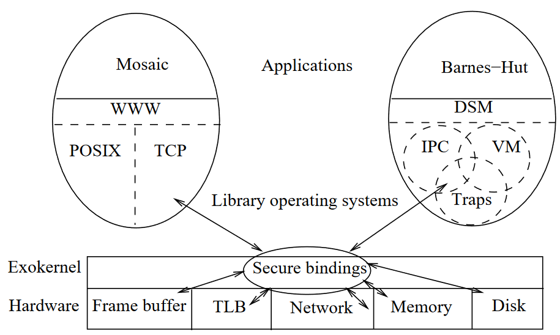
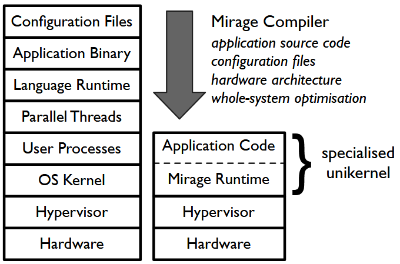
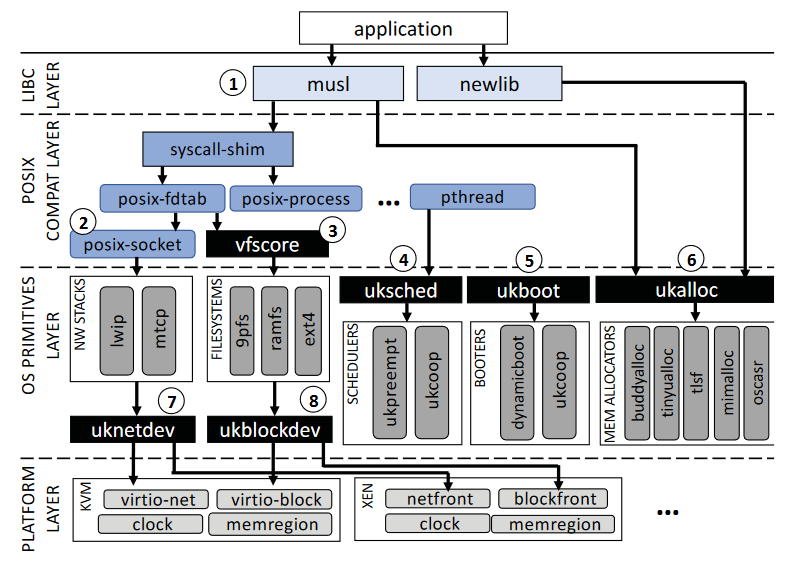
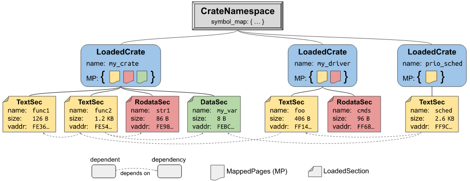
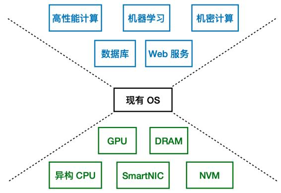
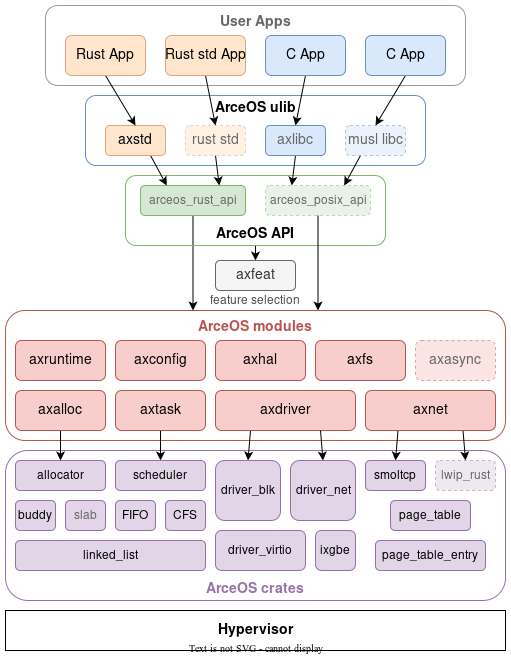
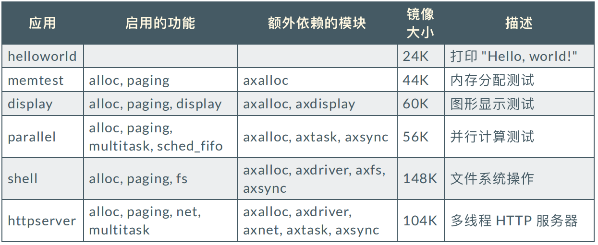
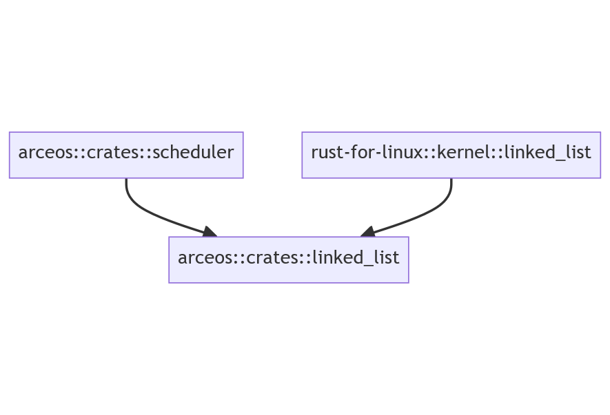

<!-- _class: cover_b
<!-- _header: "" --> 
<!-- _footer: "" --> 
<!-- _paginate: "" --> 

# AcerOS 组件化操作系统

@刘逸珑（华南师范大学）
更新时间：2023 年 10 月 16 日（v0.1）
<18922251299@163.com>

<!-- 
大家好，我是来自华南师范大学软件学院的刘逸珑，很荣幸今天能被邀请到这里简单分享我现在学习的 ArceOS 操作系统。
因为我现在还在学习的早期阶段，可能有很多知识还理解的不是很到位，还请诸位学长多多包涵，多多纠正我的错误。
-->
---

<!-- _class: toc_b  -->
<!-- _footer: "" -->
<!-- _header: "目录" -->
<!-- _paginate: "" -->

- [发展历史](#3)
- [开发背景](#10) 
- [ArceOS 整体架构](#13)
- [ArceOS 特性](#18)

## 发展历史
<!-- _class: trans -->
<!-- _footer: "" -->

<!--
我今天的演讲主要会分为如下几个部分进行
首先，我会简单的分享一下有关于 arceos 科研的文献综述
然后，我基于当前形式，分析一下 arceos 的开发背景
最后，我会简单的呈现并且说明一下 arceos 的整体架构以及我们开发过程中遇到的特性。
-->

### ExoKernel
<!-- _class: fixedtitleA -->
<!-- _class: navbar -->
<!-- _header: \ **发展历史** *开发背景* *ArceOS整体架构* *ArceOS特性*-->
<!-- _footer: "" -->



<!--
1995年左右，ENGLER D R, KAASHOEK M F, O’TOOLE J 提出了一种相对于传统的宏内核，微内核而言不同的新的内核形态，即外核(ExoKernel)。
外核架构与传统的操作系统架构不同，它将所有硬件资源通过 Secure bingdings 导出到不受信任的库操作系统（LibOS）。LibOS 直接使用此接口来实现系统对象和策略。 
换句话说，就是该操作系统将一般操作系统中的保护与管理分开，由操作系统负责保护，应用程序负责管理（通过内核访问硬件资源），这样的设计理念下，应用程序可以跳过更多系统层面所做的权衡，具有对于操作系统源语更灵活，拓展的访问，方便从构建更加高效的应用程序。
(没有提供有关于硬件层面的抽象，只负责系统保护和资源复用)
这款操作系统主要受制于设计的困难性（接口设计，App，LibOS等），即需要开发人员全面了解资源模型以及系统抽象，一直没有得到推广。 

Applications know better than the OS what the goal of their resource management decisions should be and therefore, they should be given as much control as possible over those decisions.
#Ref: 
    https://www.read.seas.harvard.edu/~kohler/class/cs261-f11/exokernel.html
    https://junmo1215.github.io/paper/2016/12/01/Note-Exokernel-An-Operating-System-Architecture-for-Application-Level-Resource-Management.html
-->

### Unikernel::HermiTux
<!-- _class: fixedtitleA -->
<!-- _class: navbar -->
<!-- _header: \ **发展历史** *开发背景* *ArceOS整体架构* *ArceOS特性*-->



<!--
12 年左右的时候，Google 在开发云服务的时候，尝试通过将操作系统内核与应用程序捆绑在一起以提升云服务的效率以及安全性。他们采取类似于外核的思路，不过将底层的HostOS替换成为 Hypervisor，提供了一个相对稳定的底层，降低了硬件适配的难度，同时Unikernel通过将操作系统与应用程序完全分离，使应用程序能够直接访问硬件资源（资源管理和安全功能）。
单一内核，轻量级的虚拟机，它们具有比传统操作系统更小的攻击面、更高的性能和更低的资源消耗等优势。
HermiTux 通过在系统调用级模拟 Linux 应用程序二进制接口（ABI）来实现兼容性。这种方法允许 HermiTux 在不修改应用程序本身的情况下运行原生 Linux 可执行文件。
-->

### Unikraft
<!-- _class: cols-2 navbar-->
<!-- _header: \ **发展历史** *开发背景* *ArceOS整体架构* *ArceOS特性*-->

<div class=ldiv>

**成果**

- 完全模块化的操作系统基元
- 暴露了一组可组合的，面相性能的 API 以方便开发者获得高性能

与现有的应用（nginx, SQLite, Redis）进行对比表明：

- 相较于 Linux 虚拟机而言，性能提升了 1.7 - 2.7 倍
- 应用的镜像文件大小约为 1MB，运行时需要不超过 10MB 的内存
- 除虚拟机启动时间外，启动时间约为 1ms （总启动时间 3-40ms）

</div>

<div class=rdiv>

**设计目标**

- 单一地址空间：不同应用之间通过网络进行通信
- 单一特权级：不存在用户/内核空间的分离
- 完全模块化系统：所有组件都可以根据需要删除
- 静态链接：编译器功能（DCE, LTO）
- POSIX：支持接口的同时允许API下实现专用化
- 平台抽象化：无缝为不同Hyper/VMM生成镜像

</div>

<!--
21年左右的时候，来自德国的几个研究团队研究出了一种名为unikraft的操作系统，这种OS实现了对于操作系统基元的模块化，并且暴露了一组可组合，面相性能的函数调用来方便开发者获得高性能。
根据研究论文：~，由于轻量级程序，高性能，有不需要完成比如说虚存什么的启动，因此启动速度相对于一般linux的应用程序快，同时镜像文件还小。
该OS框架主要提供对单一地址空间的应用程序支持这样不需要实现多程序支持，也不存在用户，内核空间的分离，避免了昂贵的处理器模式切换（不排斥区隔化以合理配置开支），不同的应用之间通过网络实现通信（比如说virtio）
同时，该框架又是完全模块化的操作系统，所有的组件，包括操作系统基元，驱动程序，平台代码或者是库甚至是API都可以按照需要进行添加和删除。
同时由于生成的是单一用户程序的OS，unikraft通过它kconfig和一些其他的基于文本的构建系统（类似于Cargo）以及命令行工具实现了将用户程序链接到操作系统中，通过编译器完成死代码优化以及链接时优化（即对于没有实际使用到的功能进行剪枝），这对于正常的操作系统而言是完全不可能做到的。

LibOS：应用程序内核必须静态链接在一起，用函数调用替换系统调用
Unikernel：内核只运行一个应用程序，说明内核需要怎么定制
-->

### Unikraft
<!-- _class: fixedtitleA navbar-->
<!-- _header: \ **发展历史** *开发背景* *ArceOS整体架构* *ArceOS特性*-->



<!--
libc 把系统调用改成函数调用了，
比如说ukalloc提供了同一的调用接口，可以根据应用程序的需求，自由决定选择哪个能满足规范的微库（mem allocator）进行编译。
-->

### Theseus
<!-- _class: fixedtitleA largetext navbar -->
<!-- _header: \ **发展历史** *开发背景* *ArceOS整体架构* *ArceOS特性*-->

Theseus是一个用Rust从头开始编写的新操作系统，旨在尝试新的操作系统结构，更好的状态管理，以及如何利用语言内设计原则将操作系统的责任（如资源管理）转移到编译器中。

其中所有内容都在单一地址空间（SAS）和单一特权级别（SPL）中运行。 这包括从低级内核组件到高级操作系统服务、驱动程序、库等，一直到用户应用程序的所有内容。 保护和隔离是通过编译器和语言（Rust）确保的类型安全和内存安全来提供的。

<!--
大家应该可以直接从名字上练习到那个非常出名的哲学问题，
即当一条船的每一个部分都被更换成为新的之后，这条船还是原来那条船
Theseus 操作系统其实也很大程度上基于了这样的设想，这个操作系统实际上是多个 Cells 的组合（Cells ~ 可以加载到Theseus中的代码和/或数据的单个实体）
各个 Cells 就像是船板一样，有着可以被识别，明确规定的边界，不同的 Cells 之间可以被相互组合，可以在细胞衰退或者死亡之后（实时进化和故障修复）独立进行替换。
OS对于元数据进行维护，跟踪组件之间的相互依赖关系。
通过语言内设计，忒修斯使编译器能够将其安全检查应用于操作系统的代码，并将语义错误从运行时故障转移到编译时错误，两者都比现有操作系统的程度更高。
> 忒修斯贡献了内部语言操作系统的设计方法，这需要将操作系统的执行环境与其实现语言的运行时模型相匹配，并使用语言级机制实现操作系统本身。通过语言内设计，忒修斯使编译器能够将其安全检查应用于操作系统的代码，而对代码行为的理解没有任何差距，并将语义错误从运行时故障转移到编译时错误，两者都比现有操作系统的程度更高。
-->

### Theseus
<!-- _class: fixedtitleA -->
<!-- _class: navbar -->
<!-- _header: \ **发展历史** *开发背景* *ArceOS整体架构* *ArceOS特性*-->




<!--
这些不同的组件聚集在Crate命名空间下面，在这个命名空间中实现了动态链接期间的快速链接关系解析。
下层是 LoadedCrate，这个实际上就对应着一个装载到内存中的 Crate (Rust Packages)。
在下层是对应着这个 Crates 的不同段的信息。
MappedPages（MP）对象是忒修斯对所拥有的内存区域的抽象

# Ref: https://www.theseus-os.com/Theseus/book/design/design.html#cell--crate
-->

## ArceOS 开发背景
<!-- _class: trans -->


### AcerOS::前言
<!-- _class: cols-2 navbar-->
<!-- _header: \ *发展历史* **开发背景** *ArceOS整体架构* *ArceOS特性*-->

<div class=ldiv>

⽬前计算机软硬件的发展趋势：
- 硬件：新型硬件层出不穷
- 应⽤：对性能、安全的需求越来越⾼

操作系统：发展滞后
通⽤ OS：Linux，Windows
实时 OS：RT-Thread、FreeRTOS

</div>

<div class=rimg>



</div>

<!--
小型组件化专用化OS才是今后的研发方向，（组件化 -> 易组合，可复用（部分驱动组件已经可以通过R4L为linux kernel复用） 
- 对于OS的功能可以深度的定制，可以引用针对于某个功能进行优化的模块
- ArceOS 基于Rust包管理器的生态，各个组件相当于 crate，可以比较方便的实现组件化。安全性
-->

### ArceOS::组件化 OS 的初步探索
<!-- _class: fixedtitleA navbar-->
<!-- _header: \ *发展历史* **开发背景** *ArceOS整体架构* *ArceOS特性*-->


- 多架构：x86_64/aarch64/riscv64
- 多种调度算法：FIFO、Round-robin、CFS
- VirtIO net/blk/gpu 驱动
- 基于 smoltcp 的⽹络栈
- FAT32 ⽂件系统
- Rust / C 语⾔应⽤程序

## ArceOS 整体架构
<!-- _class: trans -->

### ArceOS::整体架构
<!-- _class: cols-2 navbar-->
<!-- _header: \ *发展历史* *开发背景* **ArceOS整体架构** *ArceOS特性*-->

<div class=ldiv>

- 单应⽤
- 单地址空间（SAS）
- 单特权级（SPL）

#### 层次化
- crates
- modules
- arceos_api
- ulib
- apps
</div>

<div class=rimg>



</div>

<!--
图中 ArceOS 底部依赖 Hypervisor 主要是因为多应用运行需求和对单应用的隔离保护。
对于部分的边缘设备而言，如果安全性有一定保障，可以考虑直接基于硬件平台完成，而不需要引入 hypervisor 作为底层。
假设系统运行在 Hyper 下，这样系统就不需要自身完成隔离的任务
-->

### ArceOS::整体架构
<!-- _class: cols-2 navbar-->
<!-- _header: \ *发展历史* *开发背景* **ArceOS整体架构** *ArceOS特性*-->


<div class=ldiv>

**crates**

与 OS 的设计⽆关的公共组件
- linked_list
- page_table
- allocator
- scheduler
- drivers
- spinlock

</div>

<div class=rimg>


</div>

<!--
其中 crates 层主要保存一些与特定操作系统无关联的，比较通用的 crates，这些 crates 可以被设计发布在 crates.io 上供其他项目比如说 Rust-For-Linux 项目使用。
-->
### ArceOS::整体架构
<!-- _class: cols-2 navbar -->
<!-- _header: \ *发展历史* *开发背景* **ArceOS整体架构** *ArceOS特性*-->


<div class=ldiv>

**modules**

- 与 OS 的设计⽐较耦合的组件
    - axruntime
    - axtask
    - axnet
    - axsync
- 对 crates 组件的选取与封装:
    - axalloc
    - axdriver
    - axdisplay

</div>

<div class=rimg>


</div>
<!--
不同于 crates 主要专注于可复用，modules 设计成为包含与 ArceOS 内部设计耦合的组件或者一部分 crates 的封装 (crates adapter)
我们未来的开发目标是尽可能的减少modules的数量，增加crates的数量
-->

<!--
内核不仅接受 libc 所间接调用的 Function-Call (ArceOS由于是单特权级的，需要将ulib中的syscall 换成 funccall)[路径短速度快，不需要昂贵的处理器切换]
同时还兼容 Rust Std 接口，以尽可能的接入现有的生态。
还
内核不再支持传统的 POSIX 接口使用传统的 linux 调用接口，大大缩短调用的路径，
同时，为了支持大量的现有的程序，我们计划支持musl和rust std
-->

### ArceOS::代码统计
<!-- _class: navbar -->
<!-- _header: \ *发展历史* *开发背景* **ArceOS整体架构** *ArceOS特性*-->




<!-- 
这是一组我们之前测试的时候记录的数据
可以明显看出 ArceOS 的镜像大小是较小的
TODO：缺少对比数据  
-->

## ArceOS 特性
<!-- _class: trans -->


### ArceOS::基于 features 的模块配置
<!-- _class: fixedtitleA navbar-->
<!-- _header: \ *发展历史* *开发背景* *ArceOS整体架构* **ArceOS特性**-->

可以简单的通过对于应用程序 `Cargo.toml` 文件的修改实现对于启用不同模块的不同功能。

```toml
[dependencies] # apps/task/parallel/Cargo.toml
libax = {
    path = "../../ulib/libax",
    default-features = false,
    features = [
    "alloc", "paging", "multitask",
    "sched_fifo", # can be "sched_rr", "sched_cfs"
    ]
}
```

`rust` 语言所具有的条件编译特性可以避免编译非必要模块。

<!--
可以简单的通过对于应用程序 `Cargo.toml` 文件的修改实现对于启用不同模块的不同功能，就比如说这里我们通过最后一行中有关于 `sched_`的切换可以简单切换并发程序的算法。
同时，rust语言所具有的条件编译特性也可以很好的避免我们在编译的时候链接到非必要模块上。
-->

### ArceOS::模块复用
<!-- _class: fixedtitleA navbar -->
<!-- _header: \ *发展历史* *开发背景* *ArceOS整体架构* **ArceOS特性**-->


crates 中的各个包与操作系统底层实现无关，是可以在不同的操作系统之间实现复用的。




<!--
这个设计实际上还没有对外公开发布到 crates，目前内部存有的 linked_list 实际上与 RFL[rust-for-linux::kernel::linked_list]，SCH[arceos::crates::scheduler]的实现是一致的
-->

### ArceOS::组件相互调用
<!-- _class: cols-2 navbar -->
<!-- _header: \ *发展历史* *开发背景* *ArceOS整体架构* **ArceOS特性**-->

<div class=ldiv>

应用程序必要模块：
- axruntime：启动、初始化、组件总体管控
- axhal：硬件抽象层，提供跨平台的统⼀的 API
- axlog：打印⽇志
- axconfig：平台相关常量与内核参数定义


上层调⽤底层
- App -> ulib::axstd, ulib::axlibc
- ulib -> modules/crates
- modules -> modules/crates
- crates -> crates

</div>

<div class=rimg>


</div>

<!--
那么一般应用程序的依赖是怎么进行的呢？
除了这上面的几个应用程序必要的依赖，剩下的 modules 和 crates 实际上都是可选的，用户可以自己决定程序所需要的模块以及 features。

除了部分特殊的 crate 存在反向向上的依赖，其他大部分的情况下都是通过Cargo.toml文件来实现对应的依赖的。
-->

### ArceOS::组件相互调用
<!-- _class: fixedtitleA navbar-->
<!-- _header: \ *发展历史* *开发背景* *ArceOS整体架构* **ArceOS特性**-->

底层调用上层 || 打破循环依赖: Rust FFI 进⾏调⽤；axtask::kernel_guard(crate) 需要关闭内核抢占

```rust
// crates/kernel_guard/src/lib.rs
#[crate_interface::def_interface] // define
pub trait KernelGuardIf {
    fn disable_preempt();
    fn enable_preempt();
}
crate_interface::call_interface!(KernelGuardIf::disable_preempt); // call
```
```rust
// modules/axtask/src/lib.rs
struct KernelGuardIfImpl;
#[crate_interface::impl_interface]
impl kernel_guard::KernelGuardIf for KernelGuardIfImpl {
    fn disable_preempt() { do_disable_preempt(); } // implementation
    fn enable_preempt() { do_enable_preempt(); }
}
```
<!--
这里我们给出了一个简单的例子，就是我们 kernel_guard 的一部分实现。在这个是 crates 中关闭抢占是 ArceOS 实现自旋锁的基础，但是关闭内核抢占的这个操作是与操作系统紧密相关的，所以说必须实现在 modules ，按照一般的写法中，这个 kernel_guard 实际上也应该实现在 modules 中，但是我们将其拆解到了 crates 中进行实现（因为不符合拆分规则）。
像是在 C 语言中实现的话，我们只需要简单的调用头文件就可以对于对应的函数进行调用，但是我们认为这个是一个大问题，正是以为有这种混乱的调用关系导致了解耦困难。
但是直接在 crates 中调用 modules 中的功能实际上是反依赖链的，会导致循环依赖，这里我们受到了global_allocator的启发，通过 rust FFI 来间接的打破循环依赖，实现解耦。
-->

### ArceOS::组件相互调用
<!-- _class: fixedtitleA navbar-->
<!-- _header: \ *发展历史* *开发背景* *ArceOS整体架构* **ArceOS特性**-->

```rust
// crates/kernel_guard/src/lib.rs
extern "Rust" {
    fn __KernelGuardIf_disable_preempt();
    fn __KernelGuardIf_enable_preempt();
}
unsafe { __KernelGuardIf_disable_preempt() }; // call
```

```rust
// modules/axtask/src/lib.rs
impl kernel_guard::KernelGuardIf for KernelGuardIfImpl {
fn disable_preempt() {
    #[export_name = "__KernelGuardIf_disable_preempt"]
    fn __KernelGuardIf_disable_preempt() {  
        KernelGuardIfImpl::disable_preempt() 
    }
    do_disable_preempt(); // implementation
    } // fn enable_preempt() {}
}

```
<!--
你可以看到，这个是宏展开之后的效果，具体的实现被包装在axtask中，crates通过FFI间接的调用了modules实现的函数
-->

### ArceOS::组件注册
<!-- _class: fixedtitleA -->
<!-- _class: navbar -->
<!-- _header: \ *发展历史* *开发背景* *ArceOS整体架构* **ArceOS特性**-->

基于 `axfs_vfs::VfsOps` 和 `axfs_vfs::VfsNodeOps` 在应用程序中实现⼀个⽂件系统：


```rust
struct NewFileSystem { /* ... */ }
struct NewFileNode { /* ... */ }
impl VfsOps for NewFileSystem {
    fn root_dir(&self) -> VfsNodeRef { /* ... */ }
    // ...
}
impl VfsNodeOps for NewFileNode {
    fn get_attr(&self) -> VfsResult<VfsNodeAttr> { /* ... */ }
    fn read_at(&self, offset: u64, buf: &mut [u8]) 
    -> VfsResult<usize> { /* ... */ }
    // ...
}
```
<!--
同时，利用这个功能，我们可以比较好的实现在用户程序中注册并使用我们自己的组件，呈现出一个类似 linux FUSE(filesystem in userspace) 的效果，为开发和调试带来便利，还可以方便的核心库外复用各种有关于文件系统，驱动程序的实现。
我们通过实现 modules 中规定的 trait 可以比较好的在用户程序中注册并使用自定义组件。
-->

### ArceOS::组件注册
<!-- _class: fixedtitleA -->
<!-- _class: navbar -->
<!-- _header: \ *发展历史* *开发背景* *ArceOS整体架构* **ArceOS特性**-->
```rust
struct MyFileSystemIfImpl;
#[crate_interface::impl_interface]
impl axfs::fops::MyFileSystemIf for MyFileSystemIfImpl {
    fn new_myfs(disk: Disk) -> Arc<dyn VfsOps> {
        Arc::new(NewFileSystem::new(disk))
    }
}
```

```toml
[dependencies]
axfs = { path = "../../../modules/axfs", feature = ["myfs"] }
crate_interface = { path = "../../../crates/crate_interface" }
```

### ArceOS::单元测试
<!-- _class: fixedtitleA -->
<!-- _class: navbar -->
<!-- _header: \ *发展历史* *开发背景* *ArceOS整体架构* **ArceOS特性**-->
- 可以允许应用程序在不运行完整操作系统的情况下运行，在本机用户态对于应用程序或者模块进行调试

```bash
$ cargo test -p arceos-priority -- --nocapture
running 0 tests
test result: ok. 0 passed; 0 failed; 0 
ignored; 0 measured; 0 filtered out; finished in 0.00s
```

```bash
$ cargo test -p axtask -- --nocapture
running 0 tests
test result: ok. 0 passed; 0 failed; 0 ignored; 0 measured; 0 filtered out; finished in 0.00s
   Doc-tests axtask
running 0 tests
test result: ok. 0 passed; 0 failed; 0 ignored; 0 measured; 0 filtered out; finished in 0.00s
```

<!--
ArceOS 组件化操作系统充分的利用了Rust在测试框架上的机制，发挥了 rust 在系统级软件开发上的优势，可以允许应用程序在不运行完整操作系统的情况下运行，在本机用户态对于应用程序或者模块进行调试。
下面的这两段就是运行用户态多线程测试程序和多线程模块测试程序的截图。
-->

### ArceOS::Future Work
<!-- _class: cols-2 navbar -->
<!-- _header: \ *发展历史* *开发背景* *ArceOS整体架构* **ArceOS特性**-->

<div class=ldiv>

**正在进⾏的⼯作**：
- 硬件：树莓派 4B
- 调度算法：多核多队列/实时调度
- 内存分配算法：mimalloc/TLSF
- ⽹络栈：lwip
- ⽂件系统：ext2/ext3
- ⽤户库：Rust std 移植
- ⽀持复杂应⽤：Redis
- 异步 I/O

</div>

<div class=rdiv>

**计划实现的功能**：
- 硬件：更多 RISC-V/ARM 开发版
- 真实驱动：e1000/ixgbe ⽹卡
- 多种内核形态：宏内核/微内核
- 系统兼容层：兼容 Linux ABI
- ⽀持复杂应⽤：NGINX/tokio

</div>
<!--
尝试通过 rust 的 async 机制等来提高异步性能。
硬件：更多硬件
真实的驱动程序，现在virtio
快速构造出多种内核形态（因为是组件化的）    
-->

## THANKS !
<!-- _class: cols-2-64 largetext -->

<div class=ldiv>

@Speaker Email: 18922251299@163.com
@Speaker WeChat：OneDragon424
@Top Maintainer Email: equation618@gmail.com
@Coordinator Wechat: limingth

@Repo: github.com/arceos-org/arceos
@操作系统训练营： github.com/learningos
@rCoreOS开源社区：github.com/rcore-os
@ArceOS 开源社区：github.com/arceos-org

特别鸣谢：marp, AweSome-marp 提供幻灯片生成 

</div>

<div class=rimg>


</div>
